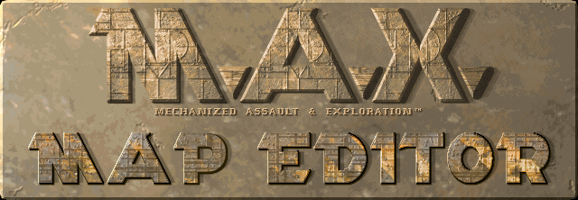

# The M.A.X. Game Map Editor

> **[M.A.X. Game Map Editor Website](https://suns-echoes.github.io/max-game-map-editor/)**
>
> **The official M.A.X. Game Map Editor website.**

> **[M.A.X. Game Map Editor GitHub Repository](https://github.com/suns-echoes/max-game-map-editor)**
>
> **The official M.A.X. Game Map Editor GitHub repository.**

> **[M.A.X. Port](https://klei1984.github.io/max/)**
>
> The M.A.X. Port is an excellent project dedicated to fixing bugs in the
> original game that prevent it from being stable and fully enjoyable.

> **[M.A.X.: Mechanized Assault & Exploration](https://en.wikipedia.org/wiki/Mechanized_Assault_%26_Exploration)**
>
> Wiki about the M.A.X. Game.


▵

## ▰ Introduction

Welcome back M.A.X. Commanders!

I present the announcement of M.A.X. Map Editor – the ultimate open-source tool
for crafting custom maps for the classic M.A.X.: Mechanized Assault & Exploration.

I started this project to fulfill our all-long dreams of assault and exploration
of an unlimited number of new planets and regions where we could try new tactics
and enjoy exploration like it was the first time.

The main goal of this project is to provide an intuitive and enjoyable mapping
experience for all M.A.X. enthusiasts.

with 🖤 for M.A.X. | maXimum map making

### ▰ Planned Features:

Here’s a sneak peek at some of the features planned for the M.A.X. Map Editor:

- build for Linux and Windows with Tauri and WebGL;
- modern and intuitive GUI with quick access to all essential features;
- fluid map zoom and panning with minimap for easy navigation and quick focus on
  specific areas of your map;
- toggleable real-time tiles animation;
- tools for easy and efficient map designing:
    - auto-shore feature,
    - semi-random fill (water, ground, obstacles),
    - terrain templates - no more headaches when drawing mountains!
    - adjacent tile suggestions to boost the design process;
- random map generator with customizable parameters:
    - seed-based generator for easy sharing of awesome maps,
    - the adjustable amount and distribution of water (open ocean, sea, lakes and rivers),
    - the adjustable amount of obstacles like mountains, cliffs, and trees;
- support for custom tile sets and palettes;
- palette editor for tweaking colors;
- palette hot swap for fast choosing the best one;

... only time will tell what other features might be.


▵

## ▰ Preparing development environment

### ▰ Setting up IDE

#### ----▰ VSCode

To prevent collision with Vite CSS processing mechanism files containing
web components styles have the `.style` extension. To allow IDE
to understand what they are, do the following:

1. Open `Settings` by pressing `Ctrl + ,`;
2. Find `files associations`;
3. Add new entry item `*.style` with `css` value.


▵

### ▰ Setting up Linux (Debian / Ubuntu)

> **References:**
>
> `Tauri v1` https://tauri.app/v1/guides/getting-started/prerequisites#setting-up-linux
>
> `Rust` https://www.rust-lang.org/tools/install

#### ----▰ Prerequisites

`Ubuntu 18 (or later)` or `Debian 11 (or later)`

#### ----▰ Installing Tauri dependencies

```sh
sudo apt update
sudo apt install libwebkit2gtk-4.0-dev \
    build-essential \
    curl \
    wget \
    file \
    libssl-dev \
    libgtk-3-dev \
    libayatana-appindicator3-dev \
    librsvg2-dev
```

#### ----▰ Installing Rust

```sh
curl --proto '=https' --tlsv1.2 -sSf https://sh.rustup.rs | sh
```

#### ----▰ Installing Node.js LTS v20 (or later)

The official website:

> https://nodejs.org/en

or Node Version Manager:

> https://github.com/nvm-sh/nvm


▵

## ▰ Building project

#### ----▰ Building full application

Run this command in the project root folder using the native terminal
(i.e.: VSCode terminal will not work)

```sh
npm run tauri build
```

The build output directory: `./app/src-tauri/target/release/bundle/`

Generated assets:

1. The AppImage: `./appimage/tauri-app_X.Y.Z_amd64.AppImage`
2. The DEB: `./deb/tauri-app_X.Y.Z_amd64.deb`
3. The RPM: `./rpm/tauri-app-X.Y.Z-1.x86_64.rpm`


#### ----▰ Building frontend only

Run this command in project root folder:

```sh
npm run build
```

The build output directory: `./app/dist/`


▵

## ▰ Developing project

#### ----▰ Development build for full application

Run this command in the project root folder using the native terminal
(i.e., the VSCode terminal will not work):

```sh
npm run tauri dev
```

The above command will build the app in development mode (with access to dev
tools and hot-module-replacements enabled).

Frontend (GUI) will be available at http://localhost:1420/ ¹

> **🛈 NOTE**
>
> ¹ This may or may not work as intended or at all due to missing API provided
>   by the Tauri backend.


#### ----▰ Development build for frontend only

Run this command in the project root folder:

```sh
npm run dev
```

Frontend (GUI) will be available at http://localhost:1420/ ¹

> **🛈 NOTE**
>
> ¹ This may or may not work as intended or at all due to missing API provided
>   by the Tauri backend.


▵

## ▰ License

### M.A.X. Game Map Editor

Copyright 2024 Aneta Suns, under ISC license.


### M.A.X. License

M.A.X. COPYRIGHT (C) 1996 INTERPLAY PRODUCTIONS. ALL RIGHTS RESERVED.
INTERPLAY PRODUCTIONS IS THE EXCLUSIVE LICENSEE AND DISTRIBUTOR.

▵
